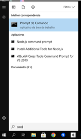
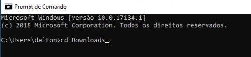

# Introdução à Programação (IP) - Trabalho Final

Algumas anotações feitas na aula: [aula.md](./aula.md "aula.md")  

Prazo máximo para definir as equipes: 09/11/2022 no ava3.  
Prazo máximo para apresentação do trabalho: 06/12/2022 (terça).  
Equipes: Não pode fazer individual.  

## Definições

- Só é permitido o uso de comandos estudados em sala de aula até o momento.  
- O conteúdo necessário para desenvolver este trabalho em sua grande maioria são conteúdos já abordados nas aulas, mas algumas partes serão explicadas durante as aulas destinadas ao desenvolvimento do trabalho.  
- As dúvidas referente a este trabalho serão respondidas SOMENTE durante os dias/horários das nossas aulas.  
- Lembre de consultar o repositório desta disciplina para ajudar no desenvolvimento deste trabalho.  
- Os trabalhos devem ser desenvolvidos em equipe, mas as avaliações serão individuais, podendo gerar notas diferentes para cada integrante da equipe.  
- Uma vez apresentado o trabalho para avaliação, este não poderá ser reapresentado.  
- A ordem de apresentação dos trabalhos serão definidos pelo professor, e poderão ser somente apresentados durante os dias/horários de aula definidos no cronograma.  
<!-- - O professor criar uma chamada com TODOS os integrantes da equipe, e num primeiro momento vai conversar individualmente com cada integrante da equipe, e no final com todos integrantes juntos.   -->
<!-- - O professor vai conversar individualmente com cada integrante da equipe, e no final com todos integrantes juntos.  
- Durante a chamada o aluno precisará compartilhar sua tela e, eventualmente, abrir sua câmera para conversar com o professor. No caso do compartilhamento de tela, o aluno deverá mostrar o código desenvolvido na IDE VSCode (ou outra da sua escolha) para permitir editar e executar o referido código se for preciso.   -->
- Durante a apresentação do trabalho o aluno deverá mostrar o código desenvolvido na IDE VSCode (ou outra da sua escolha) para permitir editar e executar o referido código se for preciso.  
<!-- - Assim que quiserem fazer a apresentação do trabalho final avisem para o professor usando o seu canal individual no MS-Teams.   -->
- Assim que a equipe quiser fazer a apresentação do trabalho final deve avisar para o professor.  
- A apresentação só poderá ser feita após a equipe postar os fontes (.java) do trabalho no AVA3.  
- O código postado/apresentado não pode ter erros de execução (use comentários para tirar possíveis erros).  

Com base nas seguintes descrições, implemente o problema do: **Jogo da Velha**.  

**ATENÇÃO**: deve seguir fielmente a descrição seguinte. Implementações a mais do descrito no código serão descontadas na nota.  

Ter uma classe descrita a seguir …  

## JogoDaVelha

- o único import que deve ser usado é *java.util.Scanner*;  
- o construtor declara a única ocorrência do objeto *teclado* da classe *Scanner* para permitir ler dados do console usando o teclado;
- o método main só instancia o construtor desta classe;  
- o construtor declara a matriz (*mapa);  
- a matriz *mapa* tem o tamanho 3 x 3;
- o mapa é definido pelo tipo primitivo char;   
- o construtor chama o método *jogarPartida*;   
- o construtor controla se "Deseja jogar novamente (s/n)?", que deve ser implementado usando um ```Do/While``` e seguir as mensagens como demostrado no exemplo de execução.  
- o método jogarPartida “limpa" o mapa a cada nova partida; 
- usar o caractere ' ' (espaço em branco) para limpar o mapa; 
- o método jogarPartida sorteia quem inicia a partida (jogador ou PC);
- usar o método sortear disponibilizado no enunciado;  
- o método `jogarPartida` tem a variável que conta quantas jogadas já foram realizadas;  
- o método `jogarPartida` chama o método de desenhar o mapa;  
- o método `jogarPartida` tem o laço que controla as jogadas, alternando a vez entre jogador e PC.  
- a cada jogada, testar se alguém venceu a partida (jogador ou PC);  
- considerar o caso de empate no final da partida, caso nenhum dos jogadores teha completado uma sequência, na horizontal, vertical ou diagonal;  
- testar no método jogar se a linha e coluna recebida representa uma célula livre no mapa, e em caso positivo marcar nesta célula quem jogou (usar a letra).  


Jogada do PC:

- a jogada do PC deve ser representada pelo caráter “O” (sua letra);  
- usar o método sortear para definir a próxima jogada do PC(linha e coluna);  
- a cada jogada testar se o PC venceu, e neste caso imprimir " ... PC GANHOU!”.  

Jogada do Jogador

- a jogada do jogador deve ser representada pelo caractere “X” (sua letra);  
- a cada jogada testar se o jogador venceu, e neste caso imprimir " ... Jogador GANHOU!”;  
- verificar se os valores de linha e coluna são válidos (dentro dos limites do mapa).  


Assinatura dos métodos

- private void jogarPartida(Scanner teclado, char [][] mapa) {}
- private void limpaMapa(char[][] mapa) {}
- private void desenha(int jogada, char[][] mapa) {}
- private boolean jogar(int l, int c, char jogador, char[][] mapa) {}
- private boolean ganhou(char jogador, char[][] mapa) {}
  
- private int sortear(int inicio, int fim) {
	return (int) ((Math.random()*fim)-inicio);
  }
  
  **Observação: ** Pode-se criar outros métodos além dos definidos acima, entretanto os métodos acima devem estar presentes na resolução.
  
## Exemplo da execução

As mensagens mostradas ao executar o código deste trabalho devem seguir o que é mostrado abaixo.

    ------------- .. jogada: 0
    |   |   |   |
    -------------
    |   |   |   |
    -------------
    |   |   |   |
    ----------------------------
    Jogador ..
      linha: 
    1
      coluna: 
    1
    ------------- .. jogada: 1
    |   |   |   |
    -------------
    |   | X |   |
    -------------
    |   |   |   |
    ----------------------------
    PC[1,0]
    ------------- .. jogada: 2
    |   |   |   |
    -------------
    | O | X |   |
    -------------
    |   |   |   |
    ----------------------------
    Jogador ..
      linha: 
    0
      coluna: 
    0
    ------------- .. jogada: 3
    | X |   |   |
    -------------
    | O | X |   |
    -------------
    |   |   |   |
    ----------------------------
    PC[0,1]
    ------------- .. jogada: 4
    | X | O |   |
    -------------
    | O | X |   |
    -------------
    |   |   |   |
    ----------------------------
    Jogador ..
      linha: 
    2
      coluna: 
    0
    ------------- .. jogada: 5
    | X | O |   |
    -------------
    | O | X |   |
    -------------
    | X |   |   |
    ----------------------------
    PC[0,2]
    ------------- .. jogada: 6
    | X | O | O |
    -------------
    | O | X |   |
    -------------
    | X |   |   |
    ----------------------------
    Jogador ..
      linha: 
    2
      coluna: 
    1
    ------------- .. jogada: 7
    | X | O | O |
    -------------
    | O | X |   |
    -------------
    | X | X |   |
    ----------------------------
    PC[2,2]
    ------------- .. jogada: 8
    | X | O | O |
    -------------
    | O | X |   |
    -------------
    | X | X | O |
    ----------------------------
    Jogador ..
      linha: 
    1
      coluna: 
    2
    ------------- .. jogada: 9
    | X | O | O |
    -------------
    | O | X | X |
    -------------
    | X | X | O |
    ----------------------------
    ------------- .. jogada: 9
    | X | O | O |
    -------------
    | O | X | X |
    -------------
    | X | X | O |
    ----------------------------
    ... EMPATOU!

    ________________________
    Deseja jogar novamente (s/n)? 
    s
    ------------- .. jogada: 0
    |   |   |   |
    -------------
    |   |   |   |
    -------------
    |   |   |   |
    ----------------------------
    PC[2,1]
    ------------- .. jogada: 1
    |   |   |   |
    -------------
    |   |   |   |
    -------------
    |   | O |   |
    ----------------------------
    Jogador ..
      linha: 
    1
      coluna: 
    1
    ------------- .. jogada: 2
    |   |   |   |
    -------------
    |   | X |   |
    -------------
    |   | O |   |
    ----------------------------
    PC[2,0]
    ------------- .. jogada: 3
    |   |   |   |
    -------------
    |   | X |   |
    -------------
    | O | O |   |
    ----------------------------
    Jogador ..
      linha: 
    1
      coluna: 
    0
    ------------- .. jogada: 4
    |   |   |   |
    -------------
    | X | X |   |
    -------------
    | O | O |   |
    ----------------------------
    PC[0,2]
    ------------- .. jogada: 5
    |   |   | O |
    -------------
    | X | X |   |
    -------------
    | O | O |   |
    ----------------------------
    Jogador ..
      linha: 
    0
      coluna: 
    0
    ------------- .. jogada: 6
    | X |   | O |
    -------------
    | X | X |   |
    -------------
    | O | O |   |
    ----------------------------
    PC[0,1]
    ------------- .. jogada: 7
    | X | O | O |
    -------------
    | X | X |   |
    -------------
    | O | O |   |
    ----------------------------
    Jogador ..
      linha: 
    1
      coluna: 
    2
    ... Jogador GANHOU!
    ------------- .. jogada: 8
    | X | O | O |
    -------------
    | X | X | X |
    -------------
    | O | O |   |
    ----------------------------

    ________________________
    Deseja jogar novamente (s/n)? 
    s
    ------------- .. jogada: 0
    |   |   |   |
    -------------
    |   |   |   |
    -------------
    |   |   |   |
    ----------------------------
    PC[2,2]
    ------------- .. jogada: 1
    |   |   |   |
    -------------
    |   |   |   |
    -------------
    |   |   | O |
    ----------------------------
    Jogador ..
      linha: 
    1
      coluna: 
    1
    ------------- .. jogada: 2
    |   |   |   |
    -------------
    |   | X |   |
    -------------
    |   |   | O |
    ----------------------------
    PC[1,2]
    ------------- .. jogada: 3
    |   |   |   |
    -------------
    |   | X | O |
    -------------
    |   |   | O |
    ----------------------------
    Jogador ..
      linha: 
    2
      coluna: 
    0
    ------------- .. jogada: 4
    |   |   |   |
    -------------
    |   | X | O |
    -------------
    | X |   | O |
    ----------------------------
    PC[0,2]
    ... PC GANHOU!
    ------------- .. jogada: 5
    |   |   | O |
    -------------
    |   | X | O |
    -------------
    | X |   | O |
    ----------------------------

    ________________________
    Deseja jogar novamente (s/n)? 
    n
--- FIM ---


## Exemplo da execução

As mensagens mostradas ao executar o código deste trabalho devem seguir o que é mostrado ao executar o [TrabalhoFinal.jar](TrabalhoFinal.jar "TrabalhoFinal.jar").  

### Como executar um JAR

- Abra o console do Windows pressionando a tecla Windows e depois digitando ```cmd``` e pressionar ```enter```. Se for Linux ou MacOS abra o “terminal"  
  

- Agora mude de pasta, para pasta que tem o **TrabalhoFinal.jar**. No meu caso para pasta de Download  
  

- E para executar digitar

  > java -jar TrabalhoFinal.jar

- Pronto, é só usar ... e ver como deve ficar as saídas.

